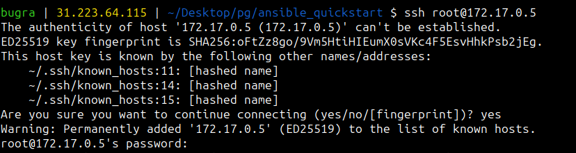
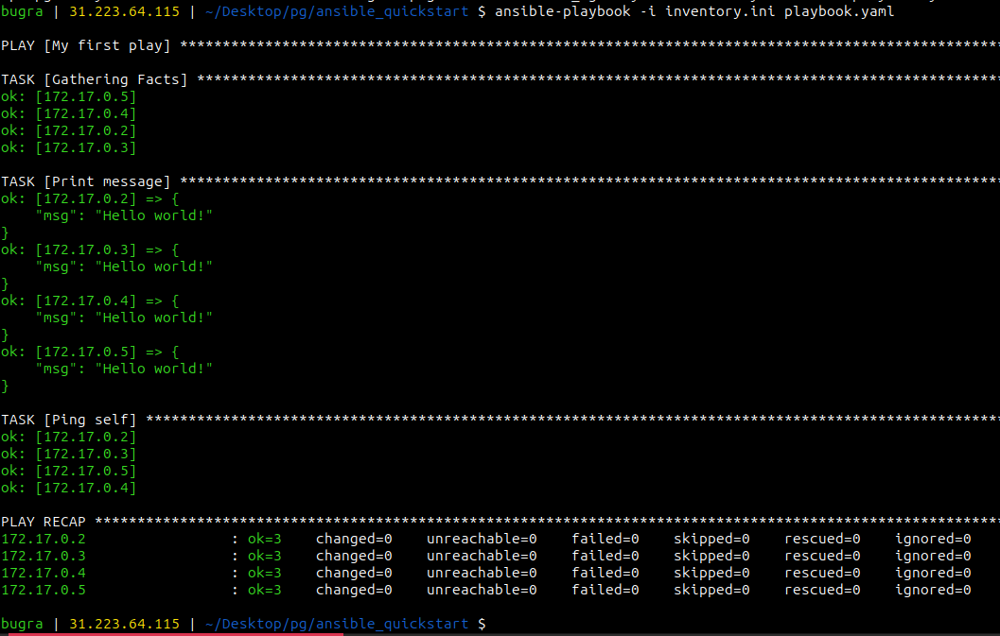

# Ansible playground

This project provides an environment for playing with Ansible. 

# Installation

### Step 1: Requirements

#### Docker
First of all, you need to install and start docker. 

[Docker installation guide](https://docs.docker.com/engine/install/)

#### Ansible

[Ansible installation guide](https://docs.ansible.com/ansible/latest/installation_guide/intro_installation.html)

#### sshpass

```
sudo apt install sshpass
```

### Step 2: Building the playground

### Step 2.1: Create the virtual machine image with Dockerfile

Place the Dockerfile in your playground directory.

Build the Docker image. It pulls the ***Ubuntu 22.04*** image from Docker Hub and creates the image with SSH installation and configuration.

**Tip:** You don't need to have ansible in your virtual machines. This is one of the best features of Ansible.

```bash
docker build --tag my_environment ./
```
You can see your created image with following command :

```bash
docker ps -a
```

### Step 2.2: Create and run the virtual machines

You can create as many machines as you want.
```bash
docker run -d --name vm1 my_environment
docker run -d --name vm2 my_environment
docker run -d --name vm3 my_environment
```
Check the ip addresses with following command : 


```bash
docker inspect vm1 |grep \"IPAddress\"
```

### Step 2.3: Create the inventory

By creating the inventory.ini file, we can easily categorize which devices to apply the automated operations and the necessary tasks to, so that the same operations can be performed on all devices at the same time, for example, all virtual machines or all databases.

Let's create a directory for playground. 

```bash
mkdir playground && cd playground
```

Create an inventory.ini file for our hosts.

```bash
touch inventory.ini
```

Add the host IP Addresses with passwords as a category called "**[virtualmachines]**".

**Hint:** The default root password for all machines is set to "**root**" when creating the image with Dockerfile.

##### Example :
```ini
[virtualmachines]
172.17.0.1 ansible_password=root
172.17.0.2 ansible_password=root
172.17.0.3 ansible_password=root

[databases]
172.17.1.12 ansible_password=test
172.17.1.33 ansible_password=123456
172.17.1.44 ansible_password=rootadminsys123

[hosts]
172.17.1.201 ansible_password=manager1111
172.17.1.202 ansible_password=user1234
172.17.1.203 ansible_password=testadmin
```

To connect via SSH (Ansible works via SSH), we need to add our fingerprint to the host's known_hosts file. The shortcut to do this is to establish a one-time ssh connection to the virtual machines.

```bash
ssh root@172.17.0.5
```
Then type "**yes**".



### Step 3: Run tasks with Ansible

To start the processes you can type the command as follows:

```bash
ansible-playbook -i inventory.ini playbook.yaml
```

The playbook.yaml has 2 tasks.

1. **Print message task:** This task uses the debug module to print the message "Hello world!" to the console.

2. **Ping self task:** This task sends a ping signal under the current running username on the target system.

```yaml
---
- name: My first play
  hosts: virtualmachines
  remote_user: root
  tasks:
    - name: Print message
      ansible.builtin.debug:
        msg: "Hello world!"

    - name: Ping self
      ansible.builtin.ping:

```


You can create various tasks with Ansible. For example, I've added an **APT upgrade** and **nginx installer** to the repository for your review.